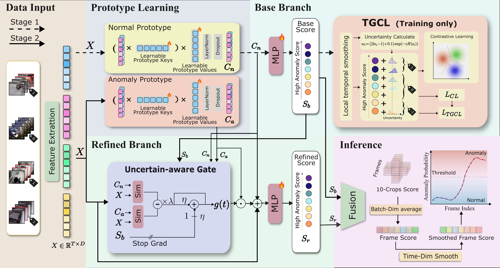

# UC-VAD (Test-Only Repository)

> This repository provides UC-VAD code for evaluation and reproducibility.

## Paper

**UC-VAD: An Efficient System for Weakly-Supervised Anomaly Detection in Video Surveillance Applications**

## Main Figure




## Repository Status

### Current Files

- `Dataset_sh.py`
- `Dataset_ucf.py`
- `eval.py`
- `main.py` 
- `options.py`
- `test.py` 
- `UC_VAD.py`
- `utils.py` 
- `LICENSE`

### Upcoming Files

- `train.py` (full training pipeline)
- `tools/ucf_sensitivity_sweep.py` (ablation/sensitivity scripts)
- `tools/ucf_tsne.py` (qualitative t-SNE visualization)
- supplementary experiment scripts and logs

## Environment Setup

### Option A: Conda

```bash
conda create -n ucvad python=3.8 -y
conda activate ucvad
pip install torch torchvision torchaudio --index-url https://download.pytorch.org/whl/cu118
pip install numpy matplotlib scikit-learn
```

### Option B: pip (existing environment)

```bash
pip install torch torchvision torchaudio
pip install numpy matplotlib scikit-learn
```

## Dataset Preparation

Datasets (same links as widely used previous WS-VAD reproductions):

- **ShanghaiTech**: https://drive.google.com/drive/folders/1LUQg9J8olBwNqEnymfCEC6CkLsjaBgKO?usp=sharing
- **UCF-Crime**: https://drive.google.com/drive/folders/1B0p22_efg_26-491AAYLWdzLPc5edHSQ?usp=drive_link

### Directory Structure

Set `--dataset_path` to the root `dataset` directory (default: `./dataset`).

```text
project_root/
|-- dataset/
|   |-- ucf-crime/
|   |   |-- train_split_10crop.txt
|   |   |-- test_split_10crop.txt
|   |   |-- features/                     # .npy feature files
|   |   `-- GT/
|   |       |-- video_label_10crop.pickle
|   |       `-- ucf_gt_upgate.pickle
|   `-- shanghaitech/
|       |-- train_split_10crop.txt
|       |-- test_split_10crop.txt
|       |-- features/                     # .npy feature files
|       `-- GT/
|           |-- video_label_10crop.pickle
|           `-- frame_label.pickle
|-- bestckpt/
|   |-- ucf-crime.pkl
|   `-- shanghaitech.pkl
`-- (code files)
```

Notes:

- In the current code, the default feature path in `Dataset_ucf.py` and `Dataset_sh.py` is:
  - `<dataset_path>/<dataset_name>/features`
- You can override by passing `--feature_path` explicitly.

## How to Run (Evaluation)

> This repository currently focuses on **evaluation/testing**.

### 1) UCF-Crime

```bash
python main.py \
  --dataset_name ucf-crime \
  --dataset_path ./dataset \
  --feature_path ./dataset/ucf-crime/features \
  --pretrained_ckpt ./bestckpt/ucf-crime.pkl \
  --model_name UCF_eval \
  --fusion_static_refined_weight 0.85 \
  --fusion_max_ratio 0.16 \
  --test_smooth_kernel 11 \
  --test_persist_alpha 0.982 \
  --test_persist_blend 0.13 \
  --test_second_smooth_kernel 5 \
  --test_score_gamma 0.79 \
  --test_video_norm_mix 0.02 \
  --test_video_norm_temp 1.0 \
  --test_peak_boost 0.64 \
  --test_peak_percentile 61 \
  --test_fuse_after_avg 1
```

### 2) ShanghaiTech

```bash
python main.py \
  --dataset_name shanghaitech \
  --dataset_path ./dataset \
  --feature_path ./dataset/shanghaitech/features \
  --pretrained_ckpt ./bestckpt/shanghaitech.pkl \
  --model_name SH_eval \
  --fusion_max_ratio 0.10 \
  --fusion_static_refined_weight 0.96 \
  --test_smooth_kernel 11 \
  --test_persist_alpha 0.97 \
  --test_persist_blend 0.14 \
  --test_second_smooth_kernel 0 \
  --test_score_gamma 0.90 \
  --test_video_norm_mix 0.16 \
  --test_video_norm_temp 1.4 \
  --test_peak_boost 0.0 \
  --test_peak_percentile 0.0 \
  --test_fuse_after_avg 1
```

## Outputs

After evaluation, results are saved to:

- `./result/<model_name>/<timestamp>/result.txt`
- if `--plot 1`, anomaly maps are also exported under:
  - `./result/<model_name>/<timestamp>/plot/`

## Citation

If you find this repository useful, please cite the UC-VAD paper.

```bibtex
@article{UC-VAD,
  title={UC-VAD: An Efficient System for Weakly-Supervised Anomaly Detection in Video Surveillance Applications},
  author={Anonymous},
  journal={arXiv preprint},
  year={2026}
}
```

## License

This project follows the `LICENSE` file in this repository.


